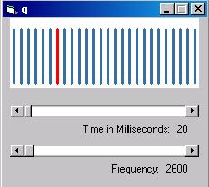

<div align="center">

## A Little Piano\(Re\-Submission\)


</div>

### Description

This applicatiom makes use of API known as BeepAPI.It alows user to make differnt sound with the different keystrokes from('a' to 'z') and spacebar.
 
### More Info
 
The user must make sure that the Piano will function only during the keypress provided there is focus to this application(i.e. if its form is on top of any other application).

It makes sound depending upon the keystrokes and settings of the time and frequency through the scrollbars.


<span>             |<span>
---                |---
**Submitted On**   |2002-10-26 12:01:20
**By**             |[Ajit Kumar Gupta](https://github.com/Planet-Source-Code/PSCIndex/blob/master/ByAuthor/ajit-kumar-gupta.md)
**Level**          |Beginner
**User Rating**    |4.8 (24 globes from 5 users)
**Compatibility**  |VB 3\.0, VB 4\.0 \(16\-bit\), VB 4\.0 \(32\-bit\), VB 5\.0, VB 6\.0
**Category**       |[Sound/MP3](https://github.com/Planet-Source-Code/PSCIndex/blob/master/ByCategory/sound-mp3__1-45.md)
**World**          |[Visual Basic](https://github.com/Planet-Source-Code/PSCIndex/blob/master/ByWorld/visual-basic.md)
**Archive File**   |[A\_Little\_P14881910282002\.zip](https://github.com/Planet-Source-Code/ajit-kumar-gupta-a-little-piano-re-submission__1-40214/archive/master.zip)

### API Declarations

```
Private Declare Function BeepAPI Lib "kernel32" Alias "Beep" (ByVal dwFrequency As Long, ByVal dwMilliseconds As Long) As Long
```


